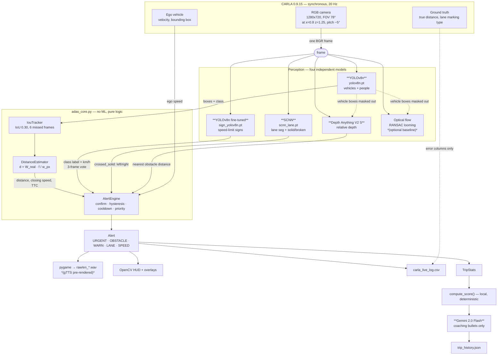
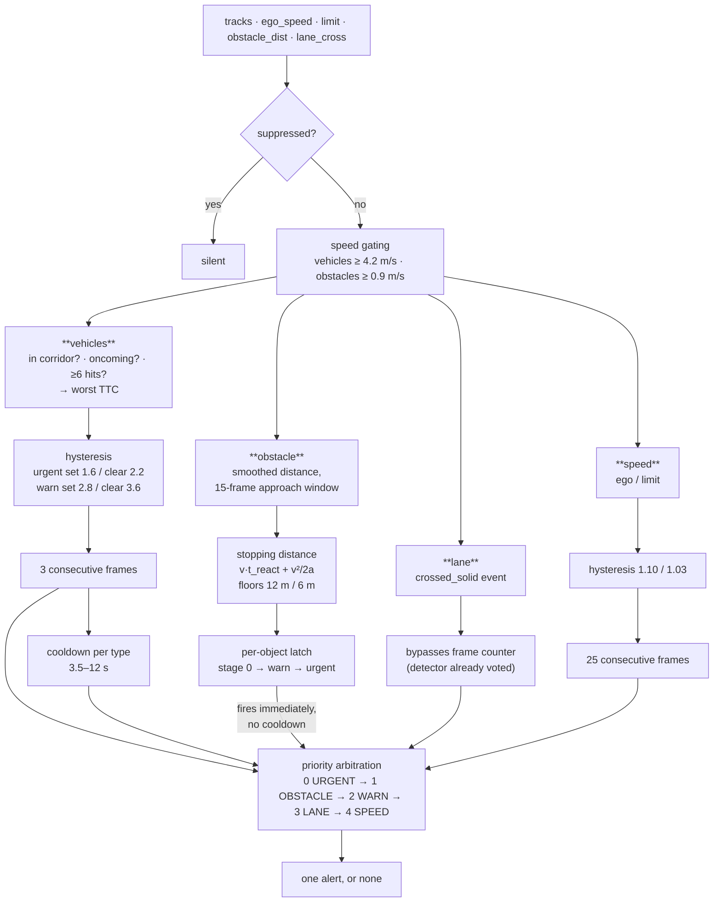
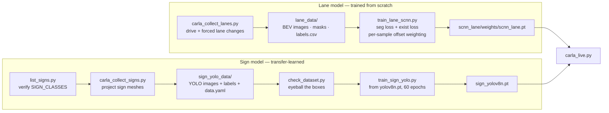
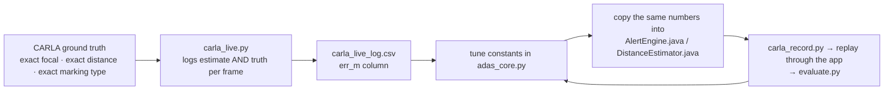

# Architecture, code structure, and execution flow

Companion to [README.md](README.md). The README says *which* model does *what*;
this document says *how the pieces fit together* and *what happens per frame*.

---

## 1. Models at a glance

| Feature | Model | Kind |
|---|---|---|
| Vehicles / pedestrians | **YOLOv8n** (stock COCO) | learned, pretrained |
| Speed-limit signs | **YOLOv8n fine-tuned**, classes `30/40/60/90` | learned, transfer-trained |
| Lane lines + solid/broken | **SCNN** (ResNet-18 encoder + spatial message passing) | learned, trained from scratch |
| Generic obstacles | **Depth Anything V2 – Small** (relative monocular depth) | learned, frozen |
| Looming baseline | Shi-Tomasi + Lucas-Kanade + RANSAC | classical CV |
| Track / distance / TTC / alerts | IoU tracker + pinhole geometry + state machine | deterministic |
| Trip coaching text | **Gemini 2.0 Flash** | LLM, optional |
| Alert voices | **gTTS**, pre-rendered WAVs | offline at runtime |

---

## 2. System architecture



**The one structural rule:** every learned model is a *sensor*. None of them
decides anything. All decisions happen in `adas_core.py`, which contains no ML at
all — so thresholds can be tuned against ground truth without retraining anything,
and the same numbers can be pasted into the Java app.

---

## 3. Per-frame execution flow

One iteration of the loop in [carla_live.py](carla_live.py#L371-L610), 20 Hz,
synchronous (the simulator advances only when we tick it):

```
 1  pygame events           W/S/A/D/SPACE/P/R/L/ESC
 2  ego_v = speed_ms(ego)   exact velocity from the simulator, not estimated
 3  apply_control(...)      S = brake while moving, reverse once stopped
 4  world.tick()            advance the sim exactly one 0.05 s step
 5  q.get()                 pull the camera frame that tick produced
                            └─ raw_data → HxWx4 → drop alpha → BGR

 6  YOLOv8n vehicles        model.predict(frame, conf=0.35)
                            └─ keep classes {0,1,2,3,5,7}, discard the rest
 7  IouTracker.update()     match by IoU ≥ 0.30, any-vehicle↔any-vehicle allowed
                            └─ per track: distance, EMA smoothing, closing speed, TTC
 8  veh_boxes               confirmed tracks (≥3 hits) — reused as an exclusion
                            mask by the depth and flow detectors

 9  sign YOLO (every 2nd)   highest-confidence detection above conf=0.50
                            └─ int(names[cls]) IS the speed value — no OCR
                            └─ same value must win 3 consecutive processed frames
                               before it overrides the current limit

10  SCNN lanes              warp to 400x500 BEV → normalize → forward pass
                            └─ seg argmax {bg,left,right} + exist softmax {absent,broken,solid}
                            └─ 12 row bands → line x → offset in metres
                            └─ nearest line → touch test → crossed_solid event

11  Depth Anything (every)  252x252 inverse relative depth → upsample
                            └─ fit metric scale on 3 road bands (median of medians)
                            └─ reconstruct X / height / forward per pixel
                            └─ mask: |lateral| ≤ 1.7 m ∧ 0.35 ≤ height ≤ 4.5 m
                            └─ minus bonnet band, minus vehicle boxes
                            └─ morphology → connected components → nearest blob
                            └─ distance = 20th percentile of that blob

12  optical flow (opt.)     TTC = dt / (scale − 1), logged for comparison only

13  AlertEngine.evaluate()  the single decision point — see §4

14  ground truth            true_nearest_ahead() + waypoint lane marking types
                            (logged for error columns; never feeds the logic)

15  play sound / banner / trip.record()
16  write one CSV row       19 columns: estimate, truth, error, alert, reason
17  draw HUD + depth panel + lane panel + sign box → imshow
18  sim_ms += 50 ; frame_i += 1
```

Steps 6, 9, 10, 11 and 12 are fully independent — no model consumes another
model's output, with one deliberate exception: **YOLO's vehicle boxes are erased
from the depth and flow masks** so a car already handled by the collision path
cannot also fire as an "unnamed obstacle".

---

## 4. How the alert decision is made

`AlertEngine.evaluate()` is the only place a warning can be produced.



Four guards stop the system chattering, and they are deliberately layered:

1. **Temporal confirmation** — N consecutive qualifying frames (3 for collision,
   25 for speeding, 3 for the sign's *value*).
2. **Hysteresis** — a separate, looser threshold to *release* than to *set*, so a
   value sitting on the boundary cannot oscillate.
3. **Cooldown** — a per-type minimum gap between utterances.
4. **Priority arbitration** — at most one alert per frame, lowest priority number
   wins.

Obstacles are the exception that proves the design: they use a **per-object latch**
instead of a cooldown ([adas_core.py:453](adas_core.py#L453)). A cooldown re-fires
while you are still approaching the same tree; a latch escalates warn → urgent and
then stays quiet until the object is gone or you have backed 6 m away from it.
Obstacles are also judged on **stopping distance**, not TTC — an obstacle is static,
so its closing speed simply *is* your own speed, a number measured directly rather
than differentiated out of a noisy depth signal.

---

## 5. File-by-file

### Runtime — what runs while you drive

| File | Role |
|---|---|
| [carla_live.py](carla_live.py) | The main loop and the only orchestrator. Spawns the world, owns the camera queue, calls every detector in order, arbitrates, draws, logs. |
| [adas_core.py](adas_core.py) | `DistanceEstimator`, `Track`, `IouTracker`, `AlertType`, `AlertEngine`. **Zero ML.** A line-for-line mirror of `DistanceEstimator.java` / `Track.java` / `IouTracker.java` / `AlertEngine.java` — same class names, same constants, same order. Tune here against ground truth, copy the numbers into Java. |
| [lane_detect.py](lane_detect.py) | BEV warp, SCNN inference, per-band line extraction, offset in metres, rolling votes, latched verdict, touch/crossing detection, corner overlay. |
| [scnn_lane/model.py](scnn_lane/model.py) | The network: ResNet-18 stem+layer1+layer2 → 1×1 reduce → `SpatialConv` message passing (D→U→R→L, kernel 9) → seg head + existence head. |
| [scnn_lane/preprocess.py](scnn_lane/preprocess.py) | The single shared BGR→normalized CHW function. Training and inference import the *same* function so their input statistics cannot drift. |
| [depth_obstacle.py](depth_obstacle.py) | Depth Anything V2 inference, per-frame metric scale recovery, 3D reconstruction, corridor/height masking, blob selection, depth colormap overlay. |
| [obstacle_flow.py](obstacle_flow.py) | The optical-flow looming baseline, with a 1–4 sensitivity dial. Comparison only — it never feeds `AlertEngine` in the current wiring. |
| [trip_summary.py](trip_summary.py) | `TripStats` counters, local deterministic score, Gemini call for coaching bullets, JSON history append. |

### Offline — data, training, checking

| File | Role |
|---|---|
| [carla_collect_lanes.py](carla_collect_lanes.py) | Drives with forced random lane changes and writes BEV images + masks + `labels.csv`, labelled from `wp.*_lane_marking.type`. Imports `build_warp_matrix` from `lane_detect.py` so training geometry is byte-identical to inference geometry. |
| [train_lane_scnn.py](train_lane_scnn.py) | Segmentation loss + existence loss, both weighted **per sample** by the true offset-from-line (up to 10×), because only ~9 % of frames have the car near a line and those are exactly the frames the touch warning depends on. |
| [carla_collect_signs.py](carla_collect_signs.py) | Writes a YOLO-format sign dataset. Uses `get_level_bbs(TrafficSigns)` for the visible mesh and matches each to its nearest `traffic.speed_limit.*` trigger actor for the value, with a `facing_dot` test to reject the blank back of a sign. |
| [train_sign_yolo.py](train_sign_yolo.py) | Fine-tunes `yolov8n.pt` → `sign_yolov8n.pt`, optional TFLite/ONNX export. |
| [check_dataset.py](check_dataset.py) | Contact sheet of labelled frames. Run before training — thirty seconds beats fifteen minutes on a broken dataset. |
| [list_signs.py](list_signs.py) | Counts `traffic.speed_limit.*` actors per town and verifies `SIGN_CLASSES` matches reality. Cheapest possible check; run it first. |
| [generate_alerts.py](generate_alerts.py) | gTTS → normalized WAVs (EN + UR) + a synthesized attention chime. Run once; runtime never calls a TTS engine, because 300–800 ms of synthesis exceeds the whole latency budget for a brake warning. |
| [carla_record.py](carla_record.py) | Records frames + `ground_truth.csv` + `meta.json` per scenario, for replay through the real Android app. |
| [evaluate.py](evaluate.py) | Compares `app_output.csv` against `ground_truth.csv`: distance MAE/bias vs range, TTC error at alert time, alert lead time, false positives, and a plot. |
| [carla_reset.py](carla_reset.py) | Un-wedges a CARLA server left in synchronous mode by a crashed run, and destroys leaked actors. |

### Artifacts

| Path | Contents |
|---|---|
| `yolov8n.pt` | Stock COCO vehicle detector |
| `sign_yolov8n.pt` | Fine-tuned sign detector (4 classes) |
| `scnn_lane/weights/scnn_lane.pt` | Trained lane model |
| `lane_data/`, `sign_yolo_data/` | Auto-labelled training sets |
| `runs/detect/` | Ultralytics training output |
| `raw/*.wav` | Pre-rendered alert audio |
| `carla_live_log.csv` | Per-frame estimate-vs-truth log |
| `trip_history.json` | Appended trip reports |
| `.env` | `GEMINI_API_KEY` — gitignored |

---

## 6. Training pipelines



Neither dataset was hand-annotated. CARLA already knows where every lane line and
every sign is, so labelling reduces to reading the map API and doing pinhole
projection. That is the reason both models exist at all — hand-labelling thousands
of frames was never going to happen.

**One ordering constraint that matters:** `SIGN_CLASSES = [30, 40, 60, 90]` is a
fixed list, and a YOLO class index is its position in it. If a new town turns up an
unseen speed value, **append** it — re-sorting silently renumbers every label file
already written.

---

## 7. Validation loop

The pipeline is written twice on purpose: once in Python here, once in Java in the
Android app. The Python side exists so thresholds can be tuned where the truth is
knowable.



`ground_truth_focal(width, fov)` means the focal length is never calibrated by
hand in simulation — it is derived from the camera geometry
([adas_core.py:590](adas_core.py#L590)), which removes one whole error source and
lets you answer the question that is otherwise unanswerable on a real road: *is the
distance estimator wrong, or is the alert logic wrong?*

If the Python and Java constants ever diverge, the simulator results stop saying
anything about the app that actually ships.

---

## 8. Degradation behaviour

Nothing in the pipeline is load-bearing for the pipeline as a whole:

| Missing | Result |
|---|---|
| `sign_yolov8n.pt` | Manual speed limit, `L` cycles it |
| `scnn_lane.pt` | `--lanes` refuses with training instructions |
| `transformers` | Depth obstacles disabled, run continues |
| No CUDA | Everything runs on CPU (models drop the `.half()` path) |
| `GEMINI_API_KEY` unset or request fails/times out | Canned coaching tips; score is unaffected because it was computed locally |
| Alert WAVs absent | Alerts print to console |
| Camera frame missing on a tick | Frame skipped, loop continues |
| CARLA cleanup crashes at exit | Trip report is built and saved *first*, before any CARLA-native teardown call |
